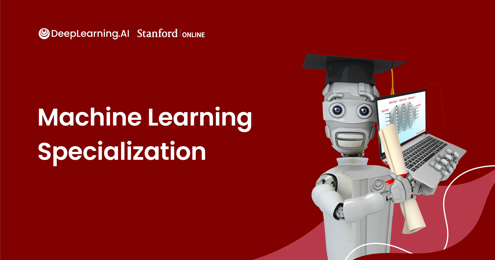
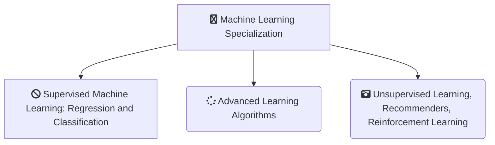

# Machine Learning Specialization on Coursera (`offered by deeplearning.ai`)

## Courses

The Machine Learning Specialization on Coursera contains three courses:

## Programming Assignments

### Course 1: Supervised Machine Learning: Regression and Classification
---

#### Week 2

[Practice lab: Linear regression](https://nbviewer.org/github/naiborhujosua/Machine-Learning-Specialization/blob/master/Supervised%20Machine%20Learning%3A%20Regression%20and%20Classification/week2/lab/C1_W2_Linear_Regression.ipynb)

### Week 3
[Practice lab: logistic regression](https://nbviewer.org/github/naiborhujosua/Machine-Learning-Specialization/blob/master/Supervised%20Machine%20Learning%3A%20Regression%20and%20Classification/week3/lab/C1_W3_Logistic_Regression.ipynb)

### Course 2: Advanced Learning Algorithms
---

#### Week 1

[Practice Lab: Neural Networks for Binary Classification](https://nbviewer.org/github/naiborhujosua/Machine-Learning-Specialization/blob/master/Advanced%20ML/week1/lab/C2_W1_Assignment.ipynb)

### Week 2
[Practice Lab: Neural Networks for Multiclass classification](https://nbviewer.org/github/naiborhujosua/Machine-Learning-Specialization/blob/master/Advanced%20ML/week2/lab/C2_W2_Assignment.ipynb)

### Week 3
[Practice Lab: Advice for Applying Machine Learning](https://nbviewer.org/github/naiborhujosua/Machine-Learning-Specialization/blob/master/Advanced%20ML/week3/lab/C2_W3_Assignment.ipynb)

### Week 4
[Practice lab: decision trees](https://nbviewer.org/github/naiborhujosua/Machine-Learning-Specialization/blob/master/Advanced%20ML/week4/lab/C2_W4_Decision_Tree_with_Markdown.ipynb)

### Course 3: Unsupervised Learning, Recommenders, Reinforcement Learning<Starting on July 20th>
--- 
I will update the repository when i finish the course for course 3

### Disclaimer 
I made this repository as **a reference**. Please do not copy paste the solution as is. You can find the solution if you read the instruction carefully. 

 
    
